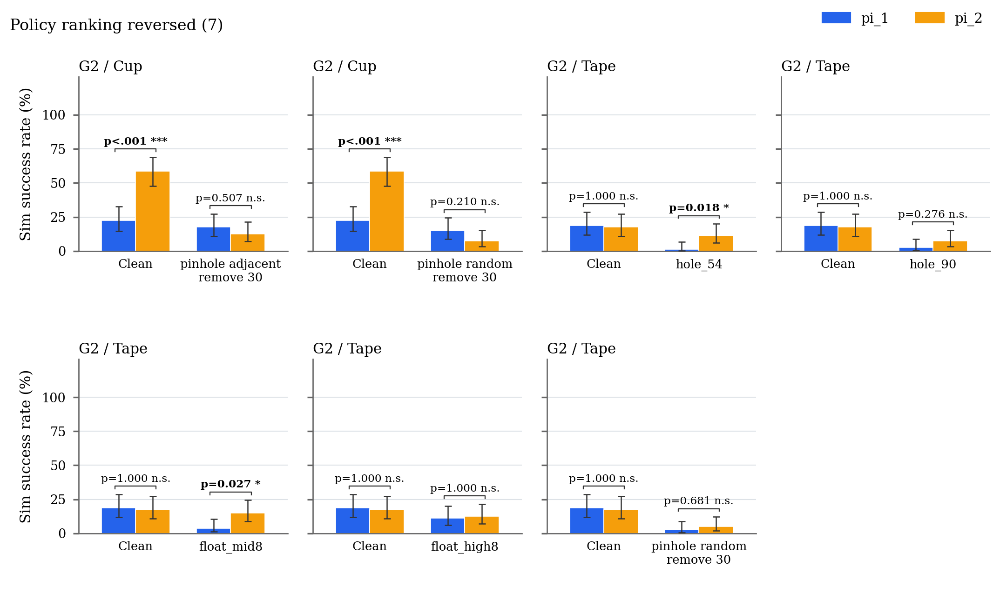
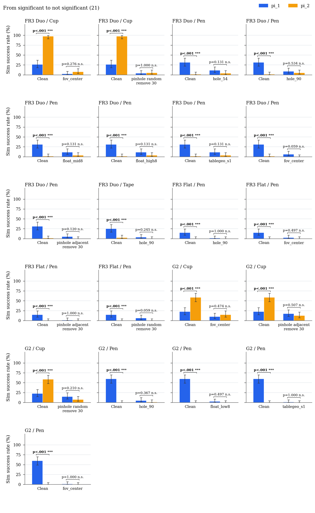
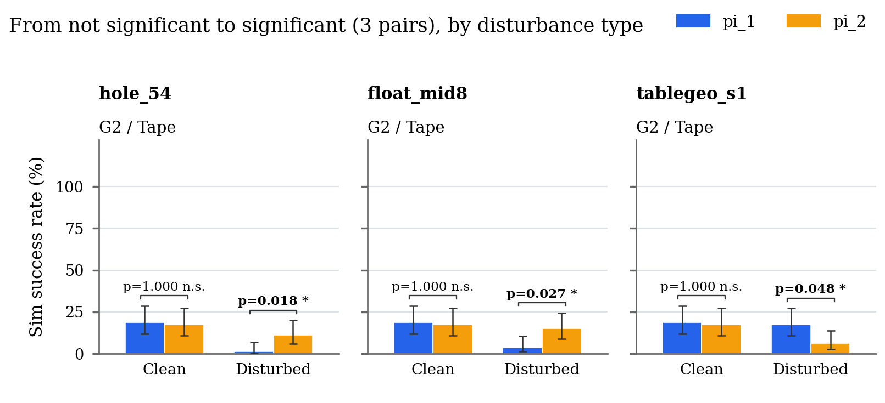
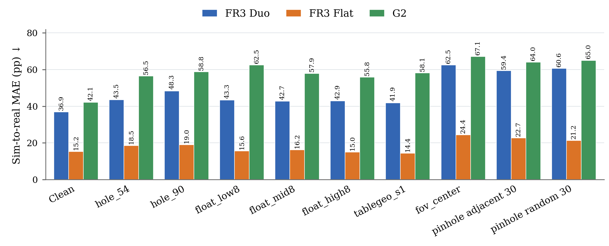
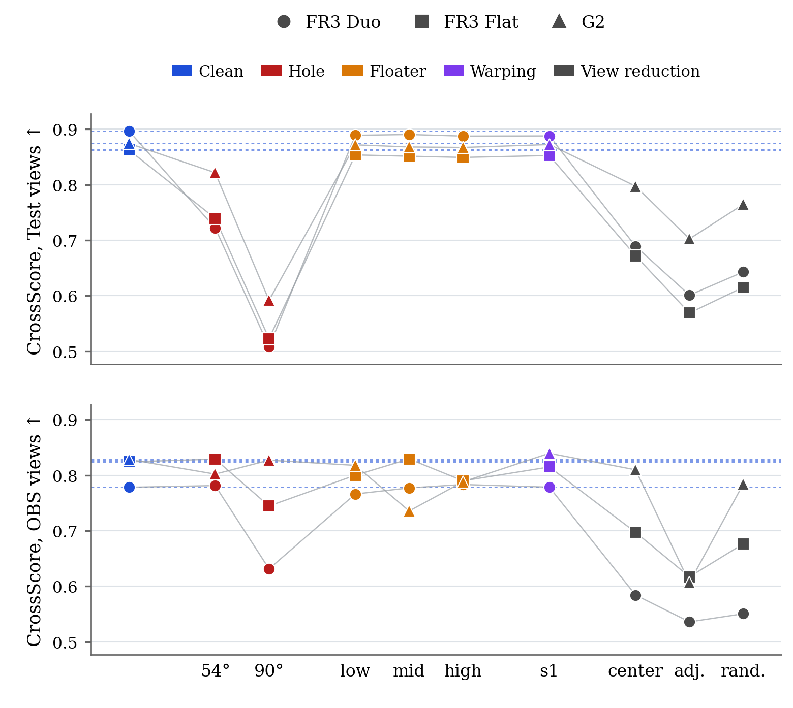
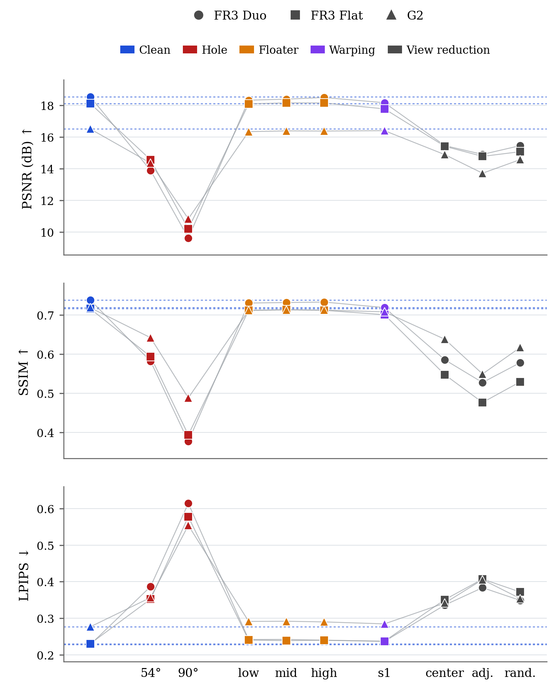
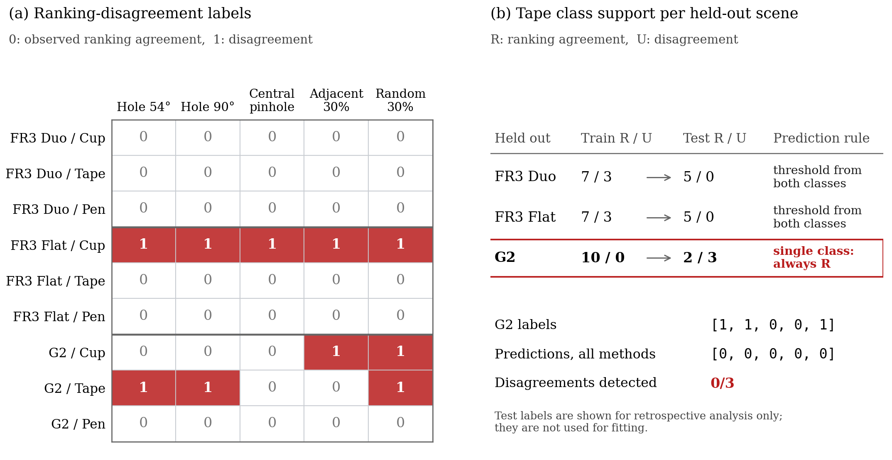

# ICRA 2027 Real2Sim — Supplementary Results

## Relationship to the fixed manuscript

This README provides supplementary results and clarifications for the fixed manuscript. The five quality-based rows from Table II are reproduced without changing their predictions. Rows marked † report additional CrossScore evaluations. The sections below clarify the evaluation inputs, supply supporting numerical results, and explain the scope of the reported comparisons.

| Fixed manuscript location | Supplemented here |
|---|---|
| Eq. (5), Sec. V-A | Section 2: success-rate MAE per scene and condition, its unit, and the Clean value behind Eq. (5) |
| Sec. IV-B (CrossScore) | Section 3: the test-image subset and quality scores; Section 6: additional classification results |
| Sec. V-D | Section 4.1: NVS-SQA Clean reference scores and the check of the reported deltas |
| Table II, Sec. V-E | Section 6: constant-prediction baselines, All-three prediction method, Tape class support and error decomposition |

## 1. Task Success Rate under Disturbances

Sim pi_1 vs. pi_2, two-sided Fisher exact test (alpha = 0.05), Clean vs. each disturbance. The full per-scene results are in Section 5.

### 1.1 Policy ranking reversed



### 1.2 From significant to not significant



### 1.3 From not significant to significant



## 2. Sim-to-Real MAE

Mean absolute error between simulated and real success rates, in percentage points. For scene $s$ and condition $c$, the 6 cells (3 tasks $t$ × 2 policies $\pi$) are averaged with equal weight:

```math
\mathrm{MAE}(s, c) = \frac{1}{6} \sum_{t,\,\pi} \left| \, 100 \cdot \frac{k^{\mathrm{sim}}_{s,c,t,\pi}}{80} \; - \; 100 \cdot \frac{k^{\mathrm{real}}_{s,t,\pi}}{20} \, \right|
```

where $k^{\mathrm{sim}}$ is the number of successes out of 80 simulated trials under condition $c$, and $k^{\mathrm{real}}$ is the number of successes out of 20 real trials. Real trials were run under Clean only, so the same real value is used for every condition.

Across the 18 policy cells, the Clean MAE is 31.39 percentage points (0.3139 when success rates are expressed on a 0–1 scale), corresponding to Eq. (5) of the main paper.



Values: [`results/data/mae.csv`](results/data/mae.csv)

## 3. CrossScore

CrossScore per scene and condition, on held-out Test views and on OBS views (mean of the right and left OBS cameras). Higher is better.

The Test-view CrossScore is computed on a subset of the Section 4 test images: only images whose person mask (DeepLabv3, 7 px dilation) contains no person pixels, i.e. Duo 105/216, Flat 62/171, G2 72/252 (the same subset under every condition; 9 G2 images without a mask are excluded because the absence of a person cannot be confirmed). Section 4 uses all test images. For a same-image comparison, the table below restates PSNR / SSIM / LPIPS on this common subset next to CrossScore. On the common subset, PSNR and SSIM are generally higher and LPIPS is generally lower than on the full test set, but this pattern is not uniform across all scene–condition pairs.



<!-- crossscore-table:start -->
| Condition | Test FR3 Duo | Test FR3 Flat | Test G2 | OBS FR3 Duo | OBS FR3 Flat | OBS G2 |
|---|---:|---:|---:|---:|---:|---:|
| Clean | 0.897 | 0.862 | 0.874 | 0.778 | 0.824 | 0.828 |
| hole_54 | 0.722 | 0.740 | 0.822 | 0.781 | 0.829 | 0.802 |
| hole_90 | 0.508 | 0.523 | 0.592 | 0.631 | 0.745 | 0.827 |
| float_low8 | 0.889 | 0.854 | 0.872 | 0.766 | 0.800 | 0.818 |
| float_mid8 | 0.890 | 0.851 | 0.868 | 0.777 | 0.829 | 0.736 |
| float_high8 | 0.887 | 0.849 | 0.867 | 0.783 | 0.790 | 0.788 |
| tablegeo_s1 | 0.888 | 0.853 | 0.872 | 0.778 | 0.815 | 0.839 |
| fov_center | 0.689 | 0.672 | 0.797 | 0.584 | 0.697 | 0.810 |
| pinhole_adjacent_remove_30 | 0.601 | 0.569 | 0.703 | 0.536 | 0.617 | 0.607 |
| pinhole_random_remove_30 | 0.643 | 0.615 | 0.765 | 0.551 | 0.677 | 0.784 |
<!-- crossscore-table:end -->

**Full-reference metrics and CrossScore on the common person-free test subset** (Duo 105, Flat 62, G2 72 images). PSNR in dB (↑), SSIM (↑), LPIPS (↓), CrossScore (↑).

| Condition | PSNR FR3 Duo | PSNR FR3 Flat | PSNR G2 | SSIM FR3 Duo | SSIM FR3 Flat | SSIM G2 | LPIPS FR3 Duo | LPIPS FR3 Flat | LPIPS G2 | CrossScore FR3 Duo | CrossScore FR3 Flat | CrossScore G2 |
|---|---:|---:|---:|---:|---:|---:|---:|---:|---:|---:|---:|---:|
| Clean | 19.88 | 19.33 | 17.63 | 0.754 | 0.740 | 0.740 | 0.206 | 0.199 | 0.239 | 0.897 | 0.862 | 0.874 |
| hole_54 | 14.34 | 15.93 | 15.82 | 0.588 | 0.639 | 0.692 | 0.380 | 0.296 | 0.291 | 0.722 | 0.740 | 0.822 |
| hole_90 | 10.03 | 10.49 | 11.00 | 0.387 | 0.443 | 0.522 | 0.608 | 0.512 | 0.508 | 0.508 | 0.523 | 0.592 |
| float_low8 | 19.63 | 19.30 | 17.53 | 0.747 | 0.736 | 0.736 | 0.218 | 0.208 | 0.248 | 0.889 | 0.854 | 0.872 |
| float_mid8 | 19.78 | 19.38 | 17.52 | 0.750 | 0.737 | 0.736 | 0.216 | 0.208 | 0.250 | 0.890 | 0.851 | 0.868 |
| float_high8 | 19.84 | 19.40 | 17.52 | 0.750 | 0.735 | 0.735 | 0.216 | 0.208 | 0.247 | 0.887 | 0.849 | 0.867 |
| tablegeo_s1 | 19.38 | 18.74 | 17.50 | 0.736 | 0.719 | 0.730 | 0.215 | 0.209 | 0.247 | 0.888 | 0.853 | 0.872 |
| fov_center | 15.81 | 16.73 | 16.06 | 0.586 | 0.590 | 0.672 | 0.328 | 0.305 | 0.293 | 0.689 | 0.672 | 0.797 |
| pinhole_adjacent_remove_30 | 15.04 | 16.04 | 14.97 | 0.511 | 0.521 | 0.591 | 0.388 | 0.356 | 0.353 | 0.601 | 0.569 | 0.703 |
| pinhole_random_remove_30 | 15.93 | 16.31 | 15.80 | 0.579 | 0.570 | 0.654 | 0.341 | 0.327 | 0.307 | 0.643 | 0.615 | 0.765 |

Values: [`results/data/crossscore.csv`](results/data/crossscore.csv) (CrossScore, both views), [`results/data/test_metrics_common_set.csv`](results/data/test_metrics_common_set.csv) (full-set and common-subset PSNR / SSIM / LPIPS side by side).

The OBS scores shown in this section are descriptive scores from `results/data/crossscore.csv` (right/left OBS cameras). They are not the OBS inputs used in Table S1. The CrossScore / OBS-TableII row in Table S1 instead uses [`results/data/crossscore_obs_table2.csv`](results/data/crossscore_obs_table2.csv), evaluated on the observation images used for the paper's NVS-SQA / OBS results.

## 4. Novel View Synthesis Quality (Test Set: PSNR / SSIM / LPIPS)

Full-reference scores on the held-out test views, per scene and condition.



PSNR in dB (↑), SSIM (↑), LPIPS (↓).

<!-- nvs-table:start -->
| Condition | PSNR FR3 Duo | PSNR FR3 Flat | PSNR G2 | SSIM FR3 Duo | SSIM FR3 Flat | SSIM G2 | LPIPS FR3 Duo | LPIPS FR3 Flat | LPIPS G2 |
|---|---:|---:|---:|---:|---:|---:|---:|---:|---:|
| Clean | 18.55 | 18.13 | 16.52 | 0.738 | 0.716 | 0.718 | 0.227 | 0.230 | 0.276 |
| hole_54 | 13.90 | 14.57 | 14.36 | 0.582 | 0.594 | 0.642 | 0.387 | 0.352 | 0.357 |
| hole_90 | 9.63 | 10.21 | 10.85 | 0.377 | 0.394 | 0.488 | 0.615 | 0.578 | 0.554 |
| float_low8 | 18.33 | 18.10 | 16.35 | 0.730 | 0.711 | 0.712 | 0.242 | 0.240 | 0.291 |
| float_mid8 | 18.40 | 18.16 | 16.39 | 0.731 | 0.713 | 0.713 | 0.242 | 0.239 | 0.292 |
| float_high8 | 18.50 | 18.16 | 16.38 | 0.733 | 0.712 | 0.712 | 0.240 | 0.240 | 0.290 |
| tablegeo_s1 | 18.17 | 17.78 | 16.41 | 0.719 | 0.700 | 0.708 | 0.236 | 0.237 | 0.284 |
| fov_center | 15.46 | 15.42 | 14.90 | 0.585 | 0.547 | 0.638 | 0.336 | 0.351 | 0.341 |
| pinhole_adjacent_remove_30 | 14.91 | 14.79 | 13.72 | 0.527 | 0.476 | 0.549 | 0.384 | 0.407 | 0.406 |
| pinhole_random_remove_30 | 15.46 | 15.08 | 14.58 | 0.578 | 0.529 | 0.617 | 0.349 | 0.372 | 0.354 |
<!-- nvs-table:end -->

Values: [`results/data/novel_view_metrics.csv`](results/data/novel_view_metrics.csv)

### 4.1 NVS-SQA reference scores for Sec. V-D

Sec. V-D reports the change of mean NVS-SQA on held-out Test views under the three view-coverage disturbances, and a spread of 0.224 between the three scenes' own Clean scores. The table gives the original computed values behind those numbers: NVS-SQA on all Test views (518×518 pinhole, 90° field of view) for Clean and for each variant, with the delta from Clean in parentheses. All nine deltas match Sec. V-D at its stated precision. The spread is the maximum minus the minimum of the three Clean scores, -2.768749 − (-2.992376) = 0.224; it is not a standard deviation.

| Scene | Test views | NVS-SQA Clean | Central pinhole | Contiguous 30% | Random 30% |
|---|---:|---:|---:|---:|---:|
| FR3 Duo | 216 | -2.768749 | -2.751186 (+0.018) | -2.828476 (-0.060) | -2.740997 (+0.028) |
| FR3 Flat | 171 | -2.923248 | -2.927977 (-0.005) | -2.891907 (+0.031) | -2.914185 (+0.009) |
| G2 | 252 | -2.992376 | -2.987888 (+0.004) | -3.010475 (-0.018) | -3.030945 (-0.039) |

Values: [`results/data/nvssqa_test_clean.csv`](results/data/nvssqa_test_clean.csv) (Clean; the variant Test scores are the Table II inputs). These NVS-SQA scores use all Test views, not the person-free subset of Section 3; NVS-SQA scores an image set as a whole, so a subset value would require recomputation.

## 5. Task Success Rate under Disturbances: All Results

Success rate of pi_1 and pi_2 per scene and task: the real result and the Clean sim result at the left as the reference, then sim under every disturbance (the pairs highlighted in Section 1 are drawn from these).

### 5.1 FR3 Duo


### 5.2 FR3 Flat


### 5.3 G2


## 6. Supplementary Analysis of Table II: Constant Baselines and Fold-wise Class Support

This section supplements Table II and Sec. V-E of the main paper with constant-prediction baselines, the distribution of ranking-disagreement labels across scenes, a class-wise analysis of Tape predictions, and CrossScore run through the same procedure. Two kinds of numbers appear below:

- For the five quality-based methods of Table II and for the constant predictors, nothing is refit. These numbers are recomputed from the out-of-fold prediction log behind Table II ([`results/data/reliability_predictions.csv`](results/data/reliability_predictions.csv)): the same conditions, the same fitted thresholds, the same predictions.
- The CrossScore rows (marked †) are new. Their thresholds are fitted here with the same protocol as Table II (scene-held-out, balanced-accuracy threshold, single-class fallback; [`results/scripts/classify_crossscore.py`](results/scripts/classify_crossscore.py)) on the same 15 conditions and labels. The re-implemented classifier reproduces all 300 logged Table II predictions when run on Table II's own inputs.

The label is the same as in the main paper: $H=0$ when the observed ranking of the two policies in simulation agrees with the real ranking, and $H=1$ when it disagrees or the two policies tie in simulation. $H$ describes the ranking of the two policies, not the success or failure of individual robot trials.

### 6.1 Table S1: Extended comparison with constant-prediction baselines

*Always reliable* predicts $\widehat{H}=0$ for every condition and *Always unreliable* predicts $\widehat{H}=1$; neither uses a quality score or a fitted threshold.

<!-- table-s1:start -->
| Method / view | Cup | Tape | Pen | Total | All-three |
|---|---:|---:|---:|---:|---:|
| Always reliable ($\widehat{H}=0$) | 8/15 | 12/15 | 15/15 | 35/45 (77.8%) | 6/15 |
| Always unreliable ($\widehat{H}=1$) | 7/15 | 3/15 | 0/15 | 10/45 (22.2%) | 9/15 |
| NVS-SQA / Test | 7/15 | 8/15 | 15/15 | 30/45 (66.7%) | 13/15 |
| NVS-SQA / OBS | 12/15 | 2/15 | 15/15 | 29/45 (64.4%) | 7/15 |
| PSNR / Test | 8/15 | 8/15 | 15/15 | 31/45 (68.9%) | 9/15 |
| SSIM / Test | 8/15 | 9/15 | 15/15 | 32/45 (71.1%) | 7/15 |
| LPIPS / Test | 8/15 | 5/15 | 15/15 | 28/45 (62.2%) | 10/15 |
| CrossScore / Test † | 7/15 | 8/15 | 15/15 | 30/45 (66.7%) | 4/15 |
| CrossScore / OBS-TableII † | 5/15 | 6/15 | 15/15 | 26/45 (57.8%) | 9/15 |
<!-- table-s1:end -->

**Table S1. Extended comparison corresponding to Table II of the main paper.** Entries are correct/total classification decisions on the same matched conditions. The five quality-based rows of Table II are reproduced without modification. Rows marked † are not in Table II: they apply the identical protocol (scene-held-out threshold maximizing balanced accuracy, single-class fallback, threshold refit per target) to the CrossScore values of Section 3, with CrossScore / Test on the held-out test views of Section 3, and CrossScore / OBS-TableII evaluated on exactly the OBS images that Table II's NVS-SQA / OBS used: the policy-observation frames of one hole_54 rollout per scene (38 frames for Duo and G2, 19 for Flat, two wrist cameras each, MuJoCo foreground composited over the re-rendered 3DGS background); the NVS-SQA scores of those same images reproduce Table II's OBS column exactly, so the two OBS rows are a like-for-like comparison. The classifier used here reproduces all 300 logged Table II predictions exactly. The Test rows use the same 15 scene-variant labels, but not identical image sets across all metrics: the original PSNR, SSIM, and LPIPS rows retain the paper's full-test-set inputs, whereas CrossScore / Test uses the filtered subset described in Section 3. Both constant predictors are reported without fitting to quality scores or target-scene labels. "Total" pools the 45 task-level decisions; "All-three" evaluates the separate binary target of whether all three task rankings agree with real evaluation, so for that column *Always unreliable* means "at least one task ranking disagrees", not "all three disagree". As in the main paper, All-three predictions come from a threshold fitted to the All-three labels, not from combining the three task-level predictions.

The SSIM result of 32/45 in Sec. V-E is the highest pooled task-level accuracy among the quality-based methods listed in Table II. The expanded comparison shows that the always-reliable predictor achieves 35/45. Thus, the reported SSIM accuracy does not demonstrate an improvement over this constant predictor on the evaluated conditions. In the pooled counts the gap sits entirely in Tape:

```math
\underbrace{8-8}_{\mathrm{Cup}} + \underbrace{9-12}_{\mathrm{Tape}} + \underbrace{15-15}_{\mathrm{Pen}} = -3
```

Equal Cup counts do not imply identical individual Cup predictions.

CrossScore, run through the same scene-held-out procedure on the same 15 conditions, does not change this picture. On Test views it reaches 30/45, the same pooled accuracy as NVS-SQA / Test and below PSNR and SSIM; on the Table II OBS views (CrossScore / OBS-TableII) it reaches 26/45, below NVS-SQA / OBS (29/45), trading a much weaker Cup result (5/15 vs. 12/15) for a slightly better Tape result (6/15 vs. 2/15). Neither CrossScore view exceeds the always-reliable predictor, and on All-three (4/15 and 9/15) neither approaches the 13/15 of NVS-SQA / Test. Separately, the All-three result of NVS-SQA / Test (13/15) exceeds both constant predictors (6/15 and 9/15); that result stands on its own, although 13/15 on three scenes does not by itself establish general reliability of scene acceptance.

### 6.2 Fig. S1: Label layout and Tape class support



**Fig. S1. Ranking-disagreement labels and Tape class support across held-out scenes.** (a) Labels for the 15 matched scene variants, with $H=1$ denoting disagreement with the observed real ranking. Cup has 8 agreements and 7 disagreements, Tape 12 and 3, Pen 15 and 0, which gives the constant-predictor rows of Table S1. (b) Tape training and test class counts for each held-out scene. All three Tape disagreements occur in G2. When G2 is held out, the training labels are all $H=0$, so the single-class fallback in Sec. IV-B predicts $H=0$ for every G2 variant. Test labels are displayed only for retrospective analysis and are not used for fitting.

The point is not that quality metrics are inherently uninformative for Tape. With this label layout and the single-class fallback, the quality score is never used in the one fold that contains Tape disagreements. Under the current protocol the Tape accuracy of any quality-based method is therefore at most 12/15, because the three G2 disagreements are always missed, and the always-reliable predictor attains that bound.

### 6.3 Table S2: Tape error decomposition

Same conditions and scene-held-out procedure as Table S1, including the CrossScore rows. Ranking disagreement ($H=1$) is the positive class: TP is a disagreement flagged as one, FN a missed disagreement, FP a false alarm on an agreement-labeled condition, and TN a correctly passed agreement.

<!-- table-s2:start -->
| Method / view | TP ↑ | FN ↓ | FP ↓ | TN ↑ | Balanced accuracy ↑ |
|---|---:|---:|---:|---:|---:|
| Always reliable | 0 | 3 | 0 | 12 | 50.0% |
| Always unreliable | 3 | 0 | 12 | 0 | 50.0% |
| NVS-SQA / Test | 0 | 3 | 4 | 8 | 33.3% |
| NVS-SQA / OBS | 0 | 3 | 10 | 2 | 8.3% |
| PSNR / Test | 0 | 3 | 4 | 8 | 33.3% |
| SSIM / Test | 0 | 3 | 3 | 9 | 37.5% |
| LPIPS / Test | 0 | 3 | 7 | 5 | 20.8% |
| CrossScore / Test † | 0 | 3 | 4 | 8 | 33.3% |
| CrossScore / OBS-TableII † | 0 | 3 | 6 | 6 | 25.0% |
<!-- table-s2:end -->

**Table S2. Tape classification errors pooled across the three held-out-scene folds.** The evaluated set contains three disagreements and twelve agreements. Balanced accuracy is computed from the pooled out-of-fold confusion counts, not averaged over single-class test folds:

```math
\mathrm{BA} = \frac{1}{2}\left(\frac{TP}{TP+FN} + \frac{TN}{TN+FP}\right), \qquad \mathrm{BA}_{\mathrm{Tape,\,SSIM}} = \frac{1}{2}\left(\frac{0}{3} + \frac{9}{12}\right) = 37.5\%
```

All quality-based methods, including both CrossScore views, miss the three Tape disagreements in the G2 fold. Their Tape accuracy differences therefore arise from false alarms on agreement-labeled conditions, rather than differences in disagreement detection. For SSIM, the 9/15 result consists of nine true negatives, three false positives, and three false negatives. Pen contains no disagreement, so disagreement recall and two-class balanced accuracy are undefined (N/A) there; its 15/15 is not evidence of disagreement detection.

---
