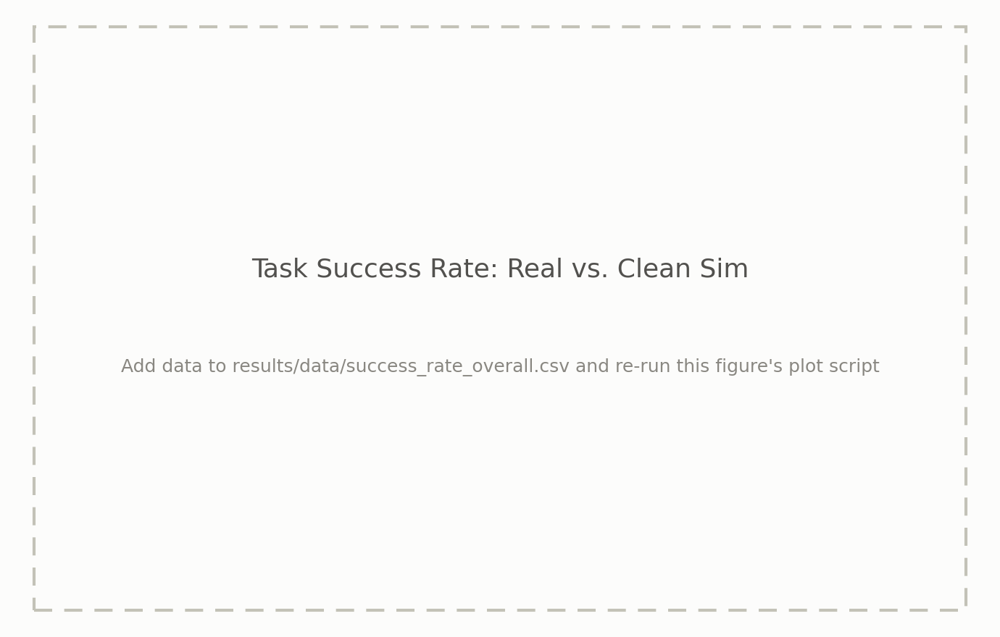

# ICRA 2027 Real2Sim — Supplementary Results

## 1. Task Success Rate: Real Robot vs. Clean Sim



## 2. Task Success Rate under Disturbances

Sim pi_1 vs. pi_2, two-sided Fisher exact test (alpha = 0.05), Clean vs. each disturbance.

### 2.1 Policy ranking reversed


### 2.2 From significant to not significant


### 2.3 From not significant to significant


### 2.4 All results: Duo


### 2.5 All results: Flat


### 2.6 All results: G2


## 3. Reconstruction Quality (MAE / CrossScore)


## 4. Novel View Synthesis Quality (Test Set: PSNR / SSIM / LPIPS)


---

Colors and fonts follow the ICRA 2026 paper's own figure scripts
(`icra2026_yubi-real2sim/figs/plots/*.py`): DejaVu Serif, real = gray /
sim = blue with policy encoded as opacity (Fig. 1 style) for the overall
chart, and policy-colored blue/amber bars for the sim-only disturbance
chart (matching the paper's counterfactual significance plots). Each
`plot_*.py` script also writes a vector `.pdf` next to its `.png`, ready to
drop into the paper.

Each figure above is generated from CSVs. `success_rate_overall/` and
`success_rate_disturbances/` pick up every CSV file found in their
directory (one panel per scene, and one figure per scene/task pair, respectively) — drop
in a new CSV there to get a new figure with no script changes. To update a
result, add/edit the relevant CSV(s) and run:

```bash
pip install -r results/scripts/requirements.txt
bash results/scripts/generate_all.sh
```

`results/scripts/ingest_policy_success.py` converts the raw per-trial policy
success log into the `success_rate_overall/` and `success_rate_disturbances/`
CSVs above:

```bash
python3 results/scripts/ingest_policy_success.py --input <path/to/policy_success_all_conditions.csv>
bash results/scripts/generate_all.sh
```
