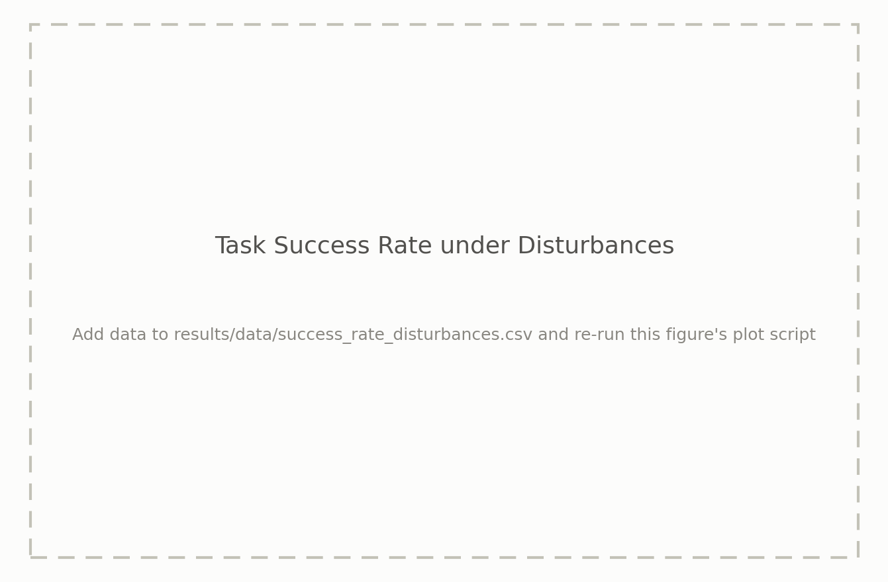

# ICRA 2027 Real2Sim — Supplementary Results

## Task Success Rate: Real Robot vs. Clean Sim


- CSV: [`results/data/success_rate_overall.csv`](results/data/success_rate_overall.csv)
- Script: [`results/scripts/plot_success_rate_overall.py`](results/scripts/plot_success_rate_overall.py)

## Task Success Rate under Disturbances



- CSV: [`results/data/success_rate_disturbances.csv`](results/data/success_rate_disturbances.csv)
- Script: [`results/scripts/plot_success_rate_disturbances.py`](results/scripts/plot_success_rate_disturbances.py)

## Reconstruction Quality (MAE / CrossScore)


- CSV: [`results/data/reconstruction_metrics.csv`](results/data/reconstruction_metrics.csv)
- Script: [`results/scripts/plot_reconstruction_metrics.py`](results/scripts/plot_reconstruction_metrics.py)

## Novel View Synthesis Quality (Test Set: PSNR / SSIM / LPIPS)


- CSV: [`results/data/novel_view_metrics.csv`](results/data/novel_view_metrics.csv)
- Script: [`results/scripts/plot_novel_view_metrics.py`](results/scripts/plot_novel_view_metrics.py)

---

Each figure above is generated from its CSV. To update a result, fill in the
corresponding CSV under `results/data/` and run:

```bash
pip install -r results/scripts/requirements.txt
bash results/scripts/generate_all.sh
```
