# ICRA 2027 Real2Sim — Supplementary Results

## Task Success Rate: Real Robot vs. Clean Sim

### Duo

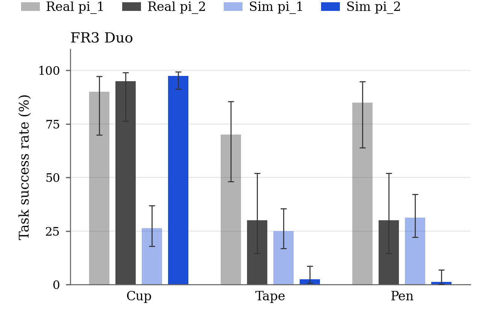

### Flat

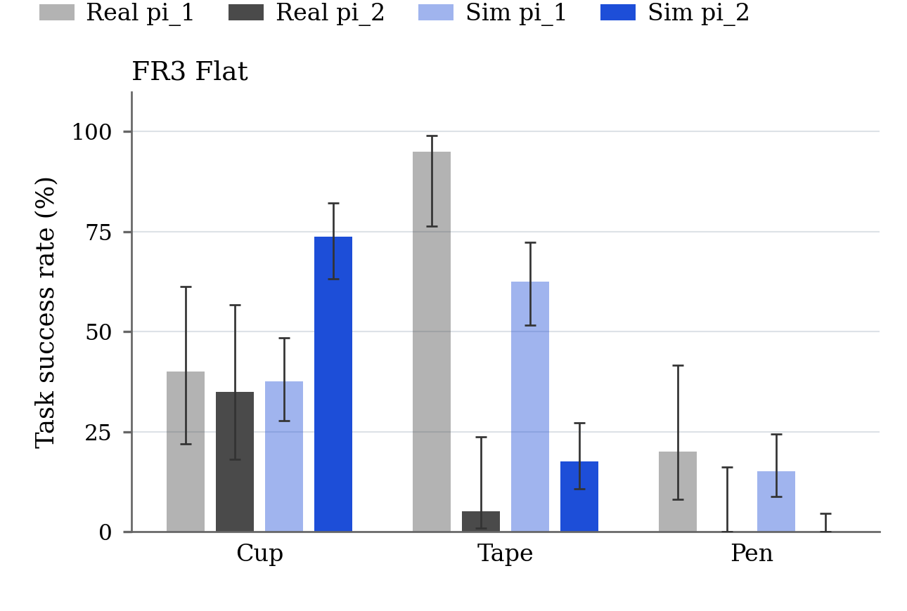

### G2

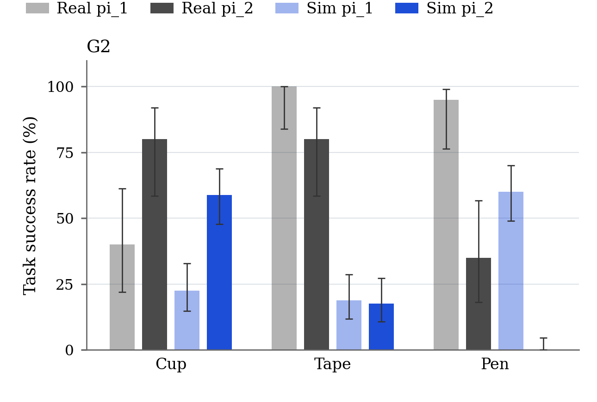

- CSVs: [`results/data/success_rate_overall/`](results/data/success_rate_overall)
- Script: [`results/scripts/plot_success_rate_overall.py`](results/scripts/plot_success_rate_overall.py)

## Task Success Rate under Disturbances

### Duo

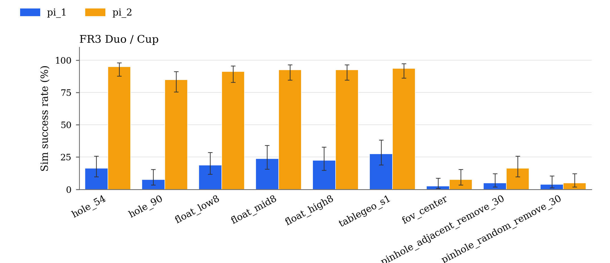

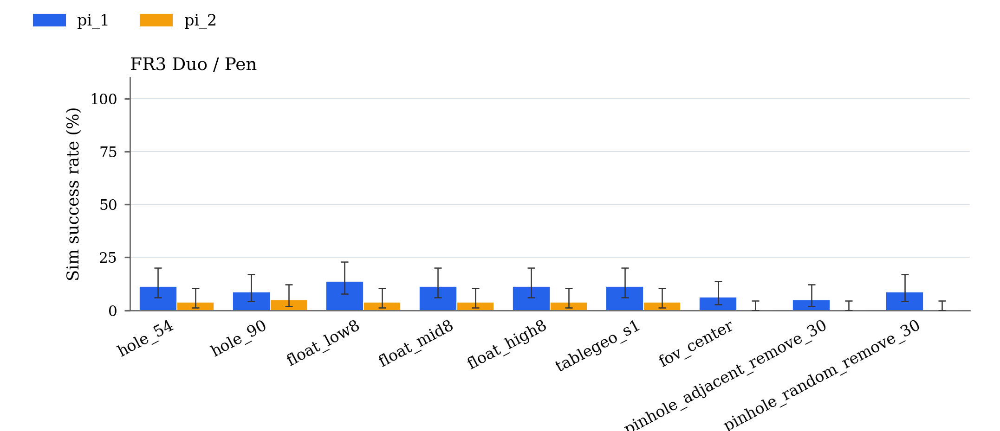

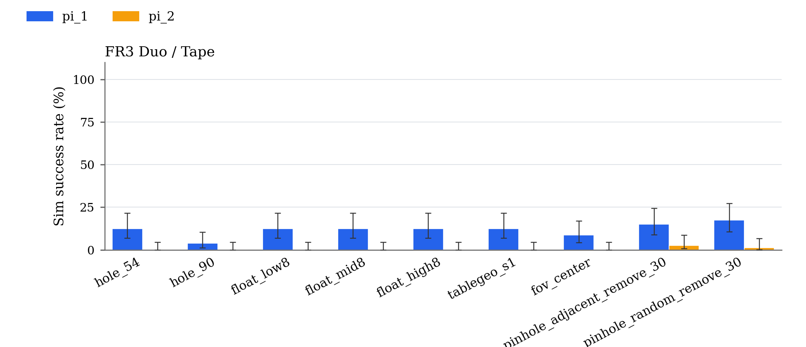

### Flat

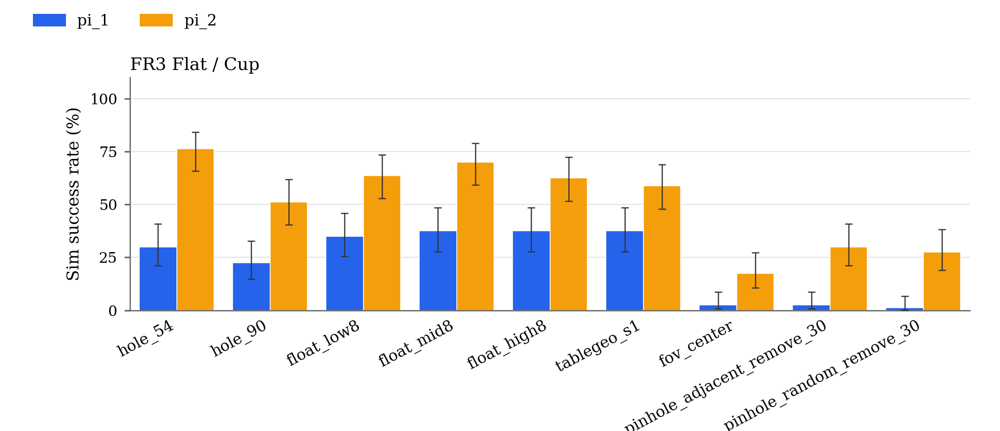

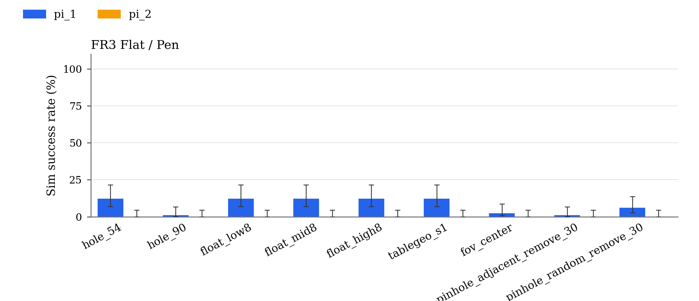

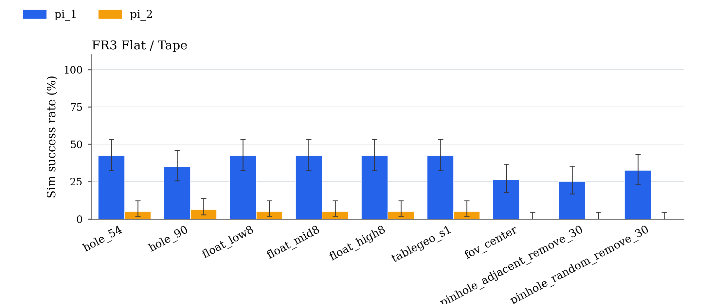

### G2

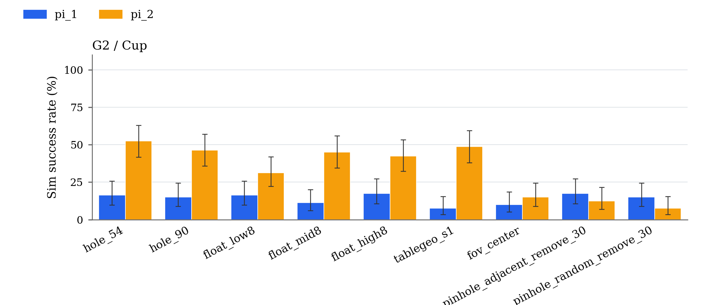

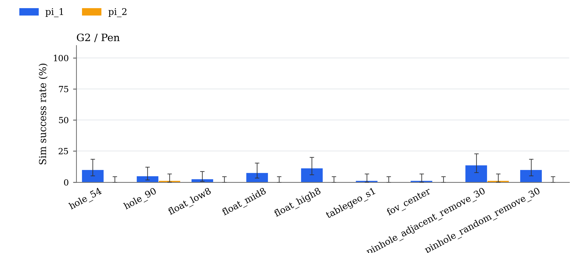

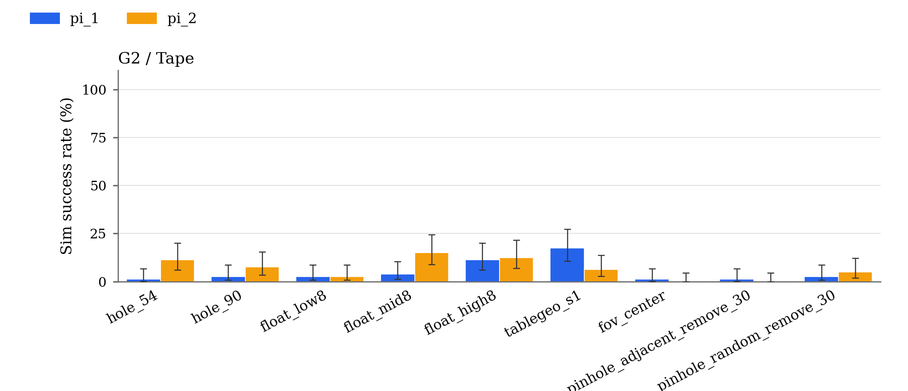

- CSVs: [`results/data/success_rate_disturbances/`](results/data/success_rate_disturbances)
- Script: [`results/scripts/plot_success_rate_disturbances.py`](results/scripts/plot_success_rate_disturbances.py)

## Reconstruction Quality (MAE / CrossScore)

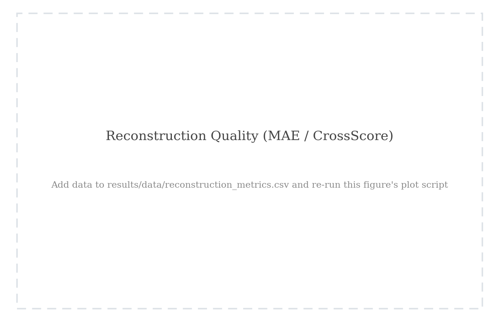

- CSV: [`results/data/reconstruction_metrics.csv`](results/data/reconstruction_metrics.csv)
- Script: [`results/scripts/plot_reconstruction_metrics.py`](results/scripts/plot_reconstruction_metrics.py)

## Novel View Synthesis Quality (Test Set: PSNR / SSIM / LPIPS)

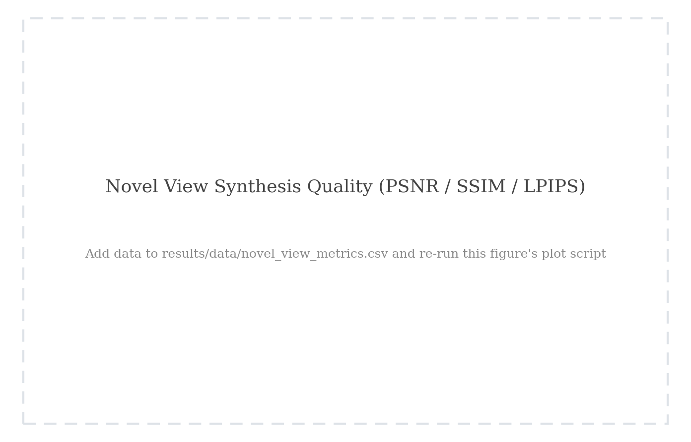

- CSV: [`results/data/novel_view_metrics.csv`](results/data/novel_view_metrics.csv)
- Script: [`results/scripts/plot_novel_view_metrics.py`](results/scripts/plot_novel_view_metrics.py)

---

Colors and fonts follow the ICRA 2026 paper's own figure scripts
(`icra2026_yubi-real2sim/figs/plots/*.py`): DejaVu Serif, real = gray /
sim = blue with policy encoded as opacity (Fig. 1 style) for the overall
chart, and policy-colored blue/amber bars for the sim-only disturbance
chart (matching the paper's counterfactual significance plots). Each
`plot_*.py` script also writes a vector `.pdf` next to its `.png`, ready to
drop into the paper.

Each figure above is generated from CSVs. `success_rate_overall/` and
`success_rate_disturbances/` produce one figure per CSV file found in their
directory (one per scene, and one per scene/task pair, respectively) — drop
in a new CSV there to get a new figure with no script changes. To update a
result, add/edit the relevant CSV(s) and run:

```bash
pip install -r results/scripts/requirements.txt
bash results/scripts/generate_all.sh
```

`results/scripts/ingest_policy_success.py` converts the raw per-trial policy
success log into the `success_rate_overall/` and `success_rate_disturbances/`
CSVs above:

```bash
python3 results/scripts/ingest_policy_success.py --input <path/to/policy_success_all_conditions.csv>
bash results/scripts/generate_all.sh
```
